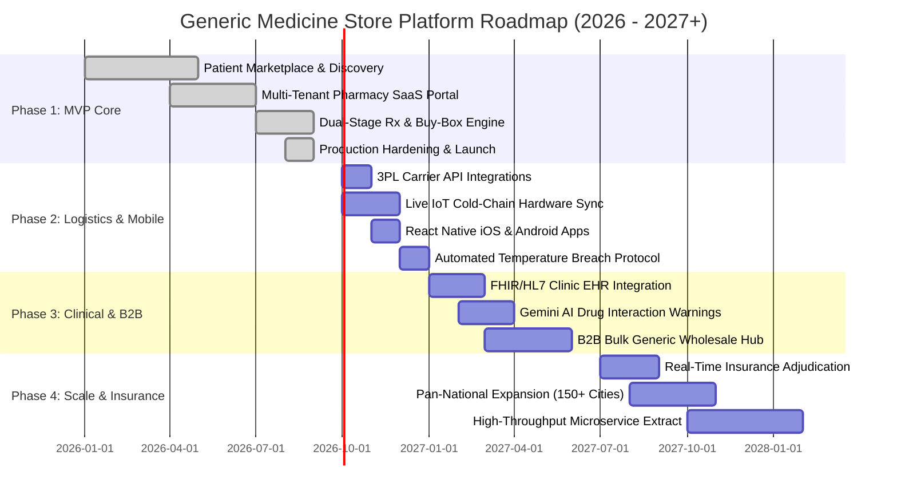
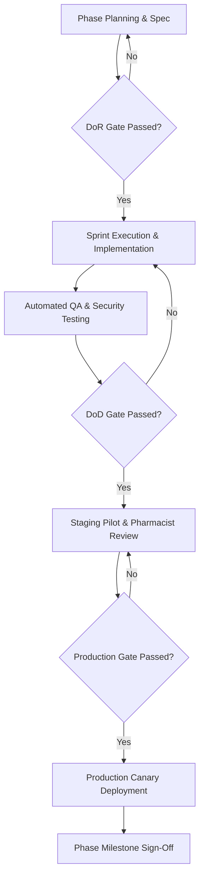

# Project Implementation Phases & Strategic Roadmap

**Project:** Generic Medicine Store & Multi-Tenant SaaS Platform  
**Codebase Identifier:** `generic-medicine-store` (`kishori`)  
**Domain:** Healthcare E-Commerce, Generic Drug Price Comparison & Pharmacy SaaS  
**Document Status:** Approved / Living Strategic Roadmap  
**Current Phase:** Phase 1 (MVP & Core Marketplace Foundation)  
**Last Synchronized:** 2026-09-09  

---

## 1. Executive Summary & Master Roadmap Horizon

The **Generic Medicine Store** product lifecycle is structured into four sequential, value-driven phases. Each phase expands platform reach, deepens regulatory compliance, introduces advanced technical automation, and scales the multi-tenant marketplace economy.



### Master Phase Summary Matrix

| Phase | Strategic Focus | Target Window | Release Target | Core Deliverables | Operational Target |
| :--- | :--- | :--- | :--- | :--- | :--- |
| **Phase 1** | **MVP & Core Marketplace** | Q1–Q3 2026 | `v1.0.0` – `v1.4.0` | Patient Web App, Multi-Tenant SaaS, Schema Isolation, Dual-Stage Rx Audit, Buy-Box Engine, Cold-Chain Sim. | 5 Pilot Cities, 50 Pharmacies, 5,000 Active Patients |
| **Phase 2** | **Logistics & Native Mobile** | Q4 2026 | `v2.0.0` – `v2.2.0` | 3PL Carrier Webhooks (Dunzo, Shadowfax, FedEx), BLE/Cellular IoT Hardware Telemetry, React Native Apps, Auto Re-Dispatch. | 25 Cities, 250 Pharmacies, 50,000 Active Patients |
| **Phase 3** | **Clinical AI & B2B Wholesale** | Q1–Q2 2027 | `v3.0.0` – `v3.2.0` | FHIR/HL7 EHR Direct Push, Gemini AI Drug Interaction Engine, Multilingual Voice Search, B2B Wholesale Procurement. | 75 Cities, 1,000 Pharmacies, 200,000 Active Patients |
| **Phase 4** | **National Scale & Insurance** | Q3 2027+ | `v4.0.0`+ | Real-time Insurance Co-Pay Settlement (RxBIN/RxPCN), Hub-and-Spoke Distribution, Selective Microservices. | 150+ Cities, 5,000 Pharmacies, 1,000,000+ Active Patients |

---

## 2. Phase 1: MVP & Core Marketplace Foundation

**Target Timeline:** January 2026 – September 2026  
**Status:** ✅ Complete — Production Hardened  
**Target Milestone:** Release `v1.4.0` ✅  
**Primary Goal:** Establish the patient-facing generic discovery engine, secure dual-stage prescription verification, multi-tenant pharmacy SaaS portal with schema-level data isolation, and algorithmic Buy-Box price competition.

### 2.1 Scope & Workstream Deliverables

#### Workstream 1.1: Patient Experience & Medicine Discovery
- [x] **Universal Molecule & Brand Search:** Instant debounced search querying branded drugs (e.g., *Lipitor*, *Glucophage*, *Augmentin*) and mapping directly to verified chemical salts (*Atorvastatin 10mg*, *Metformin 500mg*, *Amoxicillin + Clavulanic Acid*).
- [x] **Side-by-Side Savings Comparison:** Real-time calculation of percentage and absolute savings (60%–85% reduction) against government-regulated ceiling MRP.
- [x] **Therapeutic Equivalence Ratings:** Clear visual badge indicating CDSCO / FDA bio-equivalence grade (`AB Rated`, `Bio-Equivalent`, `CDSCO Approved`).
- [x] **Responsive Cart & Checkout:** Ephemeral cart state, address selection, prescription dependency check, and multi-listing auto-consolidation.
- [x] **Patient Health Profile:** Storage of chronic conditions (Hypertension, Type 2 Diabetes, Asthma), known drug allergies (Penicillin, Sulfa drugs), emergency contacts, and active session management.

#### Workstream 1.2: Dual-Stage Prescription Audit Subsystem
- [x] **Stage 1 (Client & OCR Pre-Validation):** High-resolution image/PDF upload, file type/size enforcement (JPEG, PNG, PDF <= 10MB), and Google GenAI salt/dosage extraction.
- [x] **Prescription Metadata Capture:** Capturing prescribing doctor name, medical council registration number, clinic address, and prescription issue date.
- [x] **Stage 2 (Registered Pharmacist Verification Queue):** Kanban & tabular audit portal allowing certified pharmacists to review raw prescription scans, verify dosage schedules, and attach digital sign-off.
- [x] **Audit Trail Enforcement:** Immutable logging of pharmacist identity, license number, timestamp, and audit decisions (`APPROVED`, `REJECTED_ILLEGIBLE`, `REJECTED_EXPIRED`, `DOSAGE_MISMATCH`).

#### Workstream 1.3: Real-Time Buy-Box Repricing Engine
- [x] **Weighted Multi-Factor Allocation:** Dynamic Redis-backed scoring algorithm balancing unit price (70%), stock availability (20%), and physical proximity (10%).
- [x] **Automated Vendor Repricing:** Configurable floor prices and undercut margins allowing retail pharmacies to maintain competitive Buy-Box placement automatically.
- [x] **Instant Stock Sync:** API and dashboard controls allowing pharmacy staff to toggle item availability, update batch numbers, and adjust stock counts.

#### Workstream 1.4: Multi-Tenant Architecture & Data Isolation
- [x] **Schema-per-Tenant Database Strategy:** Segregated PostgreSQL schemas (`tnt_apollo_01`, `tnt_medplus_01`, etc.) ensuring strict multi-tenant boundary isolation.
- [x] **Tenant Context Resolver:** Express middleware deriving tenant context from subdomains (`apollo.genericstore.com`) and RS256 JWT claims.
- [x] **SuperAdmin Management Portal:** Provisioning new pharmacy organizations, assigning platform commission rates (5%–12%), rotating tenant encryption keys, and auditing drug licenses.
- [x] **Role-Based Access Control (RBAC):** Granular permissions for `SUPER_ADMIN`, `PHARMACY_ADMIN`, `STAFF_PHARMACIST`, and `PATIENT`.

#### Workstream 1.5: Cold-Chain Telemetry & System Explorer
- [x] **Live Cold-Chain Tracking UI:** Visual tracking card monitoring temperature telemetry within the critical $2^\circ\text{C} - 8^\circ\text{C}$ range with breach alerting.
- [x] **Interactive Architecture Explorer:** Live architectural component visualizer across Client, Edge, IAM, Core Monolith, Multi-Tenant Database, and External Services.
- [x] **Embedded PRD Viewer:** Interactive 12-section Product Requirements Document with printable layout and section jumping.

### 2.2 Phase 1 Quality Gates & Exit Criteria
1. **Zero Tenant Data Leakage:** 100% test pass rate across cross-tenant data access security tests.
2. **Buy-Box SLA:** Redis cache Buy-Box recalculation under 50ms for 10,000 concurrent SKU queries.
3. **Prescription Security:** All prescription assets stored with AES-256 server-side encryption and served via signed, short-lived URLs (TTL < 15 minutes).
4. **Sub-Second Search Response:** Debounced search query latency under 200ms at 95th percentile.

---

## 3. Phase 2: Logistics Automation, Cold-Chain IoT & Native Mobile

**Target Timeline:** October 2026 – January 2027  
**Status:** Architectural Design & Vendor Discovery  
**Target Milestone:** Release `v2.0.0`  
**Primary Goal:** Transform order fulfillment into an automated physical operations network through 3PL delivery partner APIs, real-time Bluetooth/Cellular IoT temperature sensors, dedicated iOS/Android native applications, and autonomous breach recovery.

### 3.1 Scope & Workstream Deliverables

```
+-------------------------------------------------------------------------+
|                       Phase 2 Logistics Engine                          |
+-------------------------------------------------------------------------+
|  Pharmacist Digital Sign-Off                                            |
|       |                                                                 |
|       v                                                                 |
|  [3PL Webhook Dispatcher] ---> (Dunzo / Shadowfax / FedEx Express)     |
|       |                                                                 |
|       v                                                                 |
|  [IoT Cold-Chain Gateway] <--- (BLE / Cellular Temp Sensor 2°C - 8°C)   |
|       |                                                                 |
|       +---> Normal Temp (2-8°C)  ---> Delivered to Patient Doorstep     |
|       |                                                                 |
|       +---> Breach Alert (>8.2°C) ---> Auto-Quarantine & Re-Dispatch   |
+-------------------------------------------------------------------------+
```

#### Workstream 2.1: 3PL Carrier Integration Hub
- [ ] **Unified Carrier Abstraction Layer:** Common shipping adapter interface supporting multiple logistics partners:
  - **Dunzo On-Demand API:** Ultra-fast local delivery within 60–90 minutes for acute prescriptions.
  - **Shadowfax Hyperlocal API:** Scheduled same-day and next-day urban delivery.
  - **FedEx Healthcare Express:** Pan-regional temperature-controlled inter-city transport.
- [ ] **Automated Waybill & Manifest Generation:** Automatic generation of standard shipping labels, barcoded manifests, and compliant regulatory transit documents upon pharmacist sign-off.
- [ ] **Real-Time Courier Webhook Ingestion:** Ingesting live delivery state updates (`ASSIGNED`, `PICKED_UP`, `OUT_FOR_DELIVERY`, `DELIVERED`, `FAILED_ATTEMPT`).

#### Workstream 2.2: Live IoT Hardware Telemetry Pipeline
- [ ] **MQTT / Cellular IoT Broker:** High-throughput telemetry ingestion pipeline receiving temperature, humidity, and battery status packets from smart insulated cool-boxes every 60 seconds.
- [ ] **BLE Gateway App Integration:** Automatic synchronization of onboard Bluetooth Low Energy (BLE) temperature logger data to the delivery agent’s phone upon delivery completion.
- [ ] **Automated Cold-Chain Breach Detection:**
  - Continuous evaluation against threshold: $2.0^\circ\text{C} \le T \le 8.0^\circ\text{C}$.
  - Cumulative excursion tracking: If temperature exceeds $8.2^\circ\text{C}$ for $> 10$ minutes, trigger immediate package invalidation.
- [ ] **Autonomous Re-Dispatch Workflow:** In the event of a verified cold-chain breach:
  1. Notify the delivery driver to quarantine the package.
  2. Emit alert to patient tracking UI with transparent status explanation.
  3. Automatically route replacement order to the nearest secondary pharmacy holding required batch inventory at zero cost to patient.

#### Workstream 2.3: Native Mobile Applications (iOS & Android)
- [ ] **Patient Native App (React Native / Expo):**
  - Instant biometric authentication (FaceID / TouchID).
  - Native camera capture with automatic document perspective correction and shadow removal for prescriptions.
  - Push notifications for order dispatch, temperature stability, and refill reminders.
  - Offline-first cart and address book caching via encrypted SQLite / WatermelonDB.
- [ ] **Rider / Courier Companion App:**
  - Route navigation optimized for multi-stop delivery.
  - Instant barcode scanner for package verification at pickup and drop-off.
  - OTP and photo proof-of-delivery (POD) capture.

#### Workstream 2.4: Hyperlocal Geo-Fencing & Dynamic Routing
- [ ] **Pharmacy Service Radius Mapping:** Interactive polygonal geo-fencing defining exact delivery zones for each pharmacy branch.
- [ ] **Proximity-Based Buy-Box Weighting:** Real-time distance calculation via Google Distance Matrix API feeding directly into the Buy-Box score algorithm.

### 3.2 Phase 2 Quality Gates & Exit Criteria
1. **Dispatch Automation:** 95% of approved prescriptions dispatched to 3PL carriers within 180 seconds without manual operator intervention.
2. **Cold-Chain Reliability:** Zero compromised biological/insulin products delivered to patients (100% breach detection and quarantine).
3. **Mobile App Stability:** Crash-free sessions $> 99.8\%$ on both iOS and Android production builds.
4. **Rider App Battery Optimization:** Telemetry background service consumes $< 4\%$ battery per 8-hour shift.

---

## 4. Phase 3: Clinical EHR Sync, Gemini AI Safety & B2B Wholesale

**Target Timeline:** February 2027 – June 2027  
**Status:** Research & Technical Discovery  
**Target Milestone:** Release `v3.0.0`  
**Primary Goal:** Bridge clinical doctor workflows directly into the marketplace via FHIR/HL7 standards, deploy multimodal Gemini AI for clinical contraindication and drug-drug interaction safety, and unlock wholesale generic B2B procurement for pharmacy tenants.

### 4.1 Scope & Workstream Deliverables

#### Workstream 3.1: Clinical EHR & e-Prescription Direct Sync
- [ ] **HL7 / FHIR Ingestion Gateway:** Standardized `MedicationRequest` FHIR R4 resource endpoint accepting cryptographically signed digital prescriptions from hospital and clinic management systems (e.g., Epic, Cerner, Practo, Kareo).
- [ ] **Digital Signature Cryptographic Verification:** Instant verification of doctor digital PKI certificates against National Medical Commission / state medical council registries.
- [ ] **Automated Cart Hydration:** Seamless one-click patient checkout initiated via SMS/WhatsApp secure magic links when a doctor writes an e-prescription.

#### Workstream 3.2: Gemini AI Clinical Safety Engine
- [ ] **Drug-Drug Interaction (DDI) Evaluator:** Multimodal Gemini AI model analyzing active cart ingredients against:
  - Patient's declared chronic medications in profile.
  - Active prescriptions dispensed in the past 90 days.
  - Known clinical contraindication databases (e.g., Sildenafil + Nitrates, ACE Inhibitors + Potassium-sparing diuretics).
- [ ] **Automated Patient Alert Modal:** Tiered severity notifications (`CRITICAL_CONTRAINDICATION`, `MODERATE_INTERACTION`, `FOOD_RESTRICTION`) with clinical citations explaining risks in plain, empathetic language.
- [ ] **Pharmacist Clinical Decision Support:** Highlighting potential interactions directly within the Pharmacist Verification Queue to accelerate human clinical review.

#### Workstream 3.3: Multilingual Voice Search & Accessibility
- [ ] **Regional Language Voice Input:** Voice-to-text search engine supporting regional vernacular languages (Hindi, Bengali, Marathi, Tamil, Telugu, Kannada, Spanish).
- [ ] **Phonetic & Colloquial Molecule Matching:** Soundex/Metaphone fuzzy matching handling phonetic mispronunciations of complex drug names (e.g., "Metaformin" -> *Metformin*, "Amlodipine" -> *Amlodipine Besylate*).
- [ ] **WCAG 2.1 AAA Accessibility:** Screen reader optimization, dynamic high-contrast themes, and simplified large-text interfaces for elderly patients.

#### Workstream 3.4: B2B Wholesale Generic Procurement Marketplace
- [ ] **Manufacturer Direct Listings:** Verified pharmaceutical manufacturers (Cipla, Sun Pharma, Dr. Reddy's, Torrent, Lupin) listing bulk commercial batches directly to pharmacy tenants.
- [ ] **Dynamic Tiered Volume Pricing:** Tiered wholesale discounting based on order quantity ($100\text{ units}$, $1,000\text{ units}$, $10,000+\text{ units}$).
- [ ] **Batch Certificate of Analysis (CoA) Ingestion:** Mandatory upload and verification of laboratory CoA and stability certificates before batch listing is permitted.
- [ ] **B2B Credit & Trade Financing:** 30/60-day credit term integration via institutional financing partners with automated escrow settlement.

### 4.2 Phase 3 Quality Gates & Exit Criteria
1. **Clinical Safety Accuracy:** DDI detection engine achieves $\ge 99.5\%$ precision against benchmark clinical pharmacology test sets.
2. **FHIR Conformance:** Full compliance with HL7 FHIR Release 4 standard validated by third-party interoperability test suites.
3. **B2B Regulatory Compliance:** 100% of wholesale transactions accompanied by verified manufacturer Certificate of Analysis and drug license validation.
4. **Voice Recognition Latency:** Voice search transcription and molecule lookup completes under 1.5 seconds on 4G mobile connections.

---

## 5. Phase 4: Pan-National Scale, Automated Insurance Settlement & Microservices

**Target Timeline:** July 2027 – Q1 2028+  
**Status:** Long-Term Horizon  
**Target Milestone:** Release `v4.0.0`  
**Primary Goal:** Expand marketplace operations across 150+ metropolitan and tier-2/3 cities, implement real-time health insurance adjudication (RxBIN/RxPCN), establish automated hub-and-spoke distribution meshes, and selectively decompose high-traffic domains into independent microservices.

### 5.1 Scope & Workstream Deliverables

#### Workstream 5.1: Real-Time Insurance Adjudication & TPA Gateway
- [ ] **NCPDP Telecommunication Standard Implementation:** Direct online claims submission interface using standard insurance identifiers:
  - **RxBIN:** Bank Identification Number for pharmacy routing.
  - **RxPCN:** Processor Control Number for plan tier identification.
  - **RxGroup & Member ID:** Specific patient policy enrollment codes.
- [ ] **Instant Co-Pay vs. Insurer Split:** Real-time calculation showing exact patient out-of-pocket obligation versus insurer reimbursement coverage at the checkout step.
- [ ] **Automated TPA Claim Filing:** Direct batch reconciliation with Third-Party Administrators (TPAs) and health insurers with automated denial appeals.

#### Workstream 5.2: Pan-National Hub-and-Spoke Logistics Mesh
- [ ] **Mother Warehouse to Retail Branch Routing:** Centralized procurement hubs supplying high-velocity generic molecules to localized retail store branches based on predictive consumption models.
- [ ] **Autonomous Demand Forecasting:** Machine learning models forecasting inventory requirements based on localized disease incidence trends, seasonal surges, and historical prescription velocity.
- [ ] **Cold-Chain Drone Delivery Integration:** Drone corridor pilot for urgent temperature-sensitive antivenoms and biologicals in remote and rural terrain.

#### Workstream 5.3: Selective High-Throughput Microservice Decomposition
- [ ] **Event-Driven Architecture (Apache Kafka / AWS MSK):** Decoupling domain events (`OrderPlaced`, `RxVerified`, `TemperatureBreached`, `PayoutSettled`) from the modular monolith core.
- [ ] **Target Microservice Extraction:**
  - **Catalog & Search Service:** High-throughput read-heavy service deployed across distributed edge clusters.
  - **Order & Buy-Box Engine:** Dedicated Go/Rust high-concurrency microservice handling parallel price auctions and distributed locks.
  - **Insurance & Billing Service:** Highly audited, PCI-DSS Level 1 / HIPAA compliant transactional ledger.

### 5.2 Phase 4 Quality Gates & Exit Criteria
1. **Massive Scale Concurrency:** Platform successfully handles 100,000 requests per second with $< 100\text{ms}$ latency.
2. **Adjudication Speed:** Real-time insurance co-pay calculation returns in under 3.0 seconds during checkout.
3. **Availability Guarantee:** 99.99% system uptime across all public API and marketplace surfaces.

---

## 6. Cross-Phase Governance, Transition Gates & Definition of Done

To transition between phases, the product and engineering teams must satisfy the rigorous **Definition of Ready (DoR)** and **Definition of Done (DoD)** gates.



### 6.1 Transition Gate Checklist

| Review Area | Verification Requirement | Responsible Stakeholder | Gate Enforcement |
| :--- | :--- | :--- | :--- |
| **Data Privacy & HIPAA/DISHA** | Zero PII / PHI logged in plaintext; DB field-level encryption verified | Security Lead | **Mandatory Hard Gate** |
| **Regulatory Drug Compliance** | Registered pharmacist license verification and prescription sign-off enforced | Chief Medical Officer | **Mandatory Hard Gate** |
| **Multi-Tenant Security** | Automated penetration tests confirm zero data bleed across tenant schemas | Lead Architect | **Mandatory Hard Gate** |
| **Cold-Chain Telemetry** | 100% simulated temperature excursions trigger auto-quarantine workflows | Head of Logistics | **Mandatory Hard Gate** |
| **Financial Auditability** | Commission calculations, platform fees, and escrow balances match to the cent | Lead Financial Controller | **Mandatory Hard Gate** |

### 6.2 Semantic Versioning Release Scheme

| Version Pattern | Phase Alignment | Change Criteria | Deployment Strategy |
| :--- | :--- | :--- | :--- |
| `v1.0.0` – `v1.4.x` | Phase 1 (MVP) | Core marketplace, schema multi-tenancy, dual-stage Rx audit, Buy-Box engine | Blue/Green Deployment |
| `v2.0.0` – `v2.x.x` | Phase 2 (Logistics & Mobile) | 3PL carrier integration, physical IoT sensors, native iOS/Android apps | Phased Canary Rollout (10% -> 50% -> 100%) |
| `v3.0.0` – `v3.x.x` | Phase 3 (Clinical AI & B2B) | FHIR/HL7 direct EHR ingest, Gemini AI DDI alerts, B2B wholesale portal | Parallel Shadow Running with Pharmacist Review |
| `v4.0.0` – `v4.x.x` | Phase 4 (Insurance & Scale) | Real-time insurance claims, microservice decomposition, national mesh | Multi-Region Active-Active Deployments |

---

## 7. Comprehensive Risk Management & Mitigation Matrix

| Risk ID | Category | Description | Probability | Impact | Mitigation Strategy | Contingency Plan |
| :--- | :--- | :--- | :--- | :--- | :--- | :--- |
| **RSK-01** | **Regulatory** | CDSCO / FDA regulations change regarding digital prescription validity or generic substitution. | Medium | Critical | Maintain configurable regulatory rules engine; legal team audits all workflow updates weekly. | Roll back to strict mandatory physical prescription collection via courier prior to dispensing. |
| **RSK-02** | **Technical** | Schema migration failure in multi-tenant PostgreSQL during tenant scale ($> 500$ tenants). | Medium | High | Automated zero-downtime migration runner (`node-pg-migrate`) with dry-run verification on staging. | Automated snapshot rollback and tenant circuit-breaker to isolate affected schema. |
| **RSK-03** | **Logistics** | 3PL carrier API outage causes fulfillment backlogs for acute prescription orders. | High | High | Multi-carrier fallback routing logic (failover from Dunzo to Shadowfax or internal local fleet). | Alert customer care team; dispatch orders via manual courier dispatch portal. |
| **RSK-04** | **Safety** | Cold-chain temperature breach goes undetected due to hardware sensor packet loss. | Low | Critical | Dual-sensor redundancy in shipping containers; local flash memory logging synchronized at delivery. | Mandatory visual chemical temperature indicator (temperature sticker) verified by customer at unboxing. |
| **RSK-05** | **Financial** | Price scraping by competitors triggers aggressive repricing death-spirals. | Medium | Medium | Hard floor price enforcement in pharmacy repricing rules; edge rate limiting and Cloudflare bot management. | Automated circuit-breaker pauses repricing when price drops exceed 15% within 1 hour. |

---

## 8. Resource Allocation & Team Topology

To achieve roadmap milestones with velocity and rigor, engineering and operations are partitioned into four dedicated, cross-functional squads:

```
+---------------------------------------------------------------------------------+
|                                Platform Pods                                    |
+---------------------------------------------------------------------------------+
|  Squad 1: Patient Experience      |  Squad 2: Pharmacy SaaS & Marketplace       |
|  - Lead Frontend Eng (React/Vite) |  - Lead Backend Eng (Node.js/PostgreSQL)    |
|  - React Native Mobile Eng        |  - Distributed Systems Eng (Redis/Buy-Box)  |
|  - UI/UX Medical Designer         |  - Financial & Billing Integrations Eng     |
+-----------------------------------+---------------------------------------------+
|  Squad 3: Logistics & IoT         |  Squad 4: Clinical AI & Compliance          |
|  - Embedded IoT / Telemetry Eng   |  - Clinical Pharmacist & Compliance Officer |
|  - 3PL Logistics Integration Eng  |  - AI/ML Engineer (Gemini SDK/OCR/FHIR)     |
|  - Mobile Rider App Specialist    |  - Security & Penetration Testing Eng       |
+---------------------------------------------------------------------------------+
```

---

## 9. Related System Documentation & Context Files

- [decisions.md](file:///e:/ai%20workshop/decisions.md): Architecture Decision Records (ADRs) governing multi-tenancy, Buy-Box, and security.
- [rules.md](file:///e:/ai%20workshop/rules.md): Coding standards, security policies, and AI pair-programming instructions.
- [memory.md](file:///e:/ai%20workshop/memory.md): Living system state, database schemas, active API endpoints, and formulas.
- [changelog.md](file:///e:/ai%20workshop/changelog.md): Complete chronological release history and semantic versioning log.
